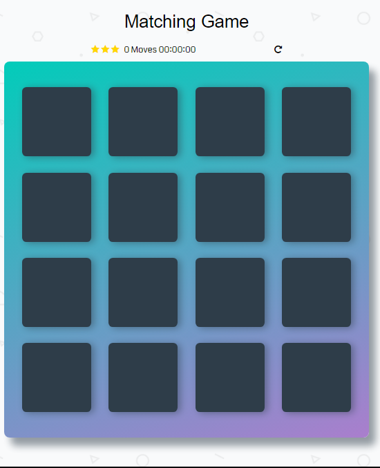

# Memory Game Project

## What is the Memory Game
This is a simple game built to test a users memory. There's a deck of cards with different icons. 

## Table of Contents

* [Instructions](#instructions)

## Challenge
Match cards in less time with less moves.

## How to play 
Go to [Memory Card Game](https://muhammedemad.github.io/memory-card-game/)

## Instructions
* Click on a card
* Keep revealing cards and working your memory to remember each unveiled card.
* Match cards properly with less moves and in faster time
